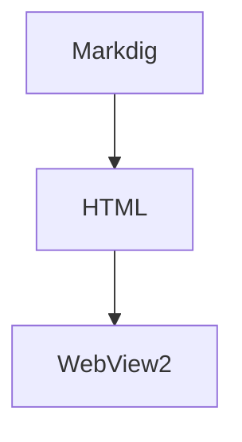

# MarkdownLite 示例文档

这是一份用于验收 **MarkdownLite** 全部渲染能力的只读示例。打开本文件后，可对照检查：标题、目录侧栏、表格、任务列表、删除线、脚注、代码高亮、相对路径图片、外链跳转。

> 文件顶部的 YAML front matter 不会出现在正文里，其中的 `title` 会用作窗口标题。

## 1. 文本样式

*斜体*、**粗体**、***粗斜体***、~~删除线~~、`行内代码`、自动链接 https://example.com 与 <https://example.org>。

> 引用块示例：
> 只读，是这款软件的全部承诺。

## 2. 列表与任务列表

1. 有序项一
2. 有序项二
   - 嵌套无序项
   - 再嵌套一层

任务列表（复选框为禁用状态，不可交互编辑）：

- [x] 解析 CommonMark + GFM
- [x] 离线代码高亮
- [ ] 永远不会出现的：编辑功能

## 3. 表格

| 功能 | 扩展 | 状态 |
| :--- | :--: | ---: |
| 表格 | PipeTables | 已完成 |
| 脚注 | Footnotes | 已完成 |
| 代码高亮 | highlight.js | 离线内置 |

## 4. 代码块高亮

```csharp
// C#
using System;

class Program
{
    static void Main()
    {
        Console.WriteLine("Hello, MarkdownLite!");
    }
}
```

```python
# Python
def fib(n: int) -> int:
    a, b = 0, 1
    for _ in range(n):
        a, b = b, a + b
    return a

print([fib(i) for i in range(10)])
```

```json
{
  "name": "mdreader-sample",
  "offline": true,
  "readonly": true
}
```



## 5. 图片（相对路径）

下面这张图位于 `samples/images/arch.png`，相对当前文件目录解析——断网也正常显示：


## 6. 脚注

Markdown 渲染由 Markdig 提供[^1]，语法高亮由内置 highlight.js 完成[^2]。

[^1]: Markdig 是一个符合 CommonMark 规范的 .NET Markdown 解析器。
[^2]: highlight.js 以本地文件形式打包，无任何 CDN 依赖。

## 7. 链接行为

- 外部链接（如 [Markdown 规范](https://spec.commonmark.org/)）会用系统默认浏览器打开，应用内不发生跳转。
- 带锚点的外链 [GFM 表格扩展](https://github.github.com/gfm/#tables-extension-) 打开后会直达对应小节（锚点不会被截断）。
- 相对 Markdown 链接 [打开子页面](子页面.md) 会在 MarkdownLite 内直接打开。
- 跨文档锚点 [子页面的「说明」小节](子页面.md#说明) 打开子页面后直接定位到该小节。
- 页内锚点：跳到 [代码块高亮](#4-代码块高亮)。

## 8. 安全演示（应当被过滤）

以下原始 HTML 与危险链接在 MarkdownLite 中会被剥离或中和，只会看到纯文本或无效链接：

<script>alert('XSS')</script>


[恶意链接](javascript:alert('XSS'))

## 9. 长文本压力测试

下面重复段落用于在 1MB 级文件中观察滚动流畅度（实际压力文件可按 README 中的命令生成）。

Lorem ipsum dolor sit amet, consectetur adipiscing elit, sed do eiusmod tempor
incididunt ut labore et dolore magna aliqua. Ut enim ad minim veniam, quis
nostrud exercitation ullamco laboris nisi ut aliquip ex ea commodo consequat.
 Duis aute irure dolor in reprehenderit in voluptate velit esse cillum dolore.
